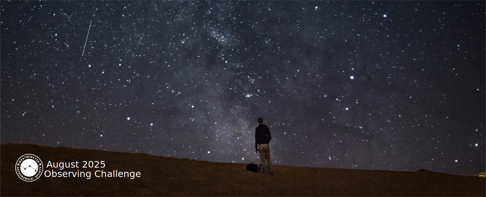
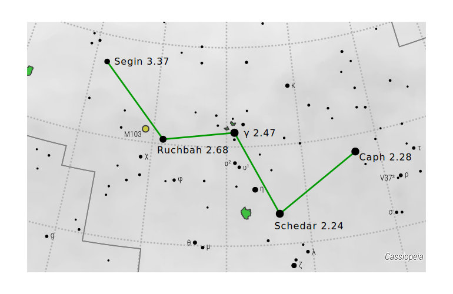
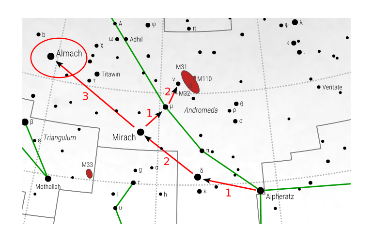
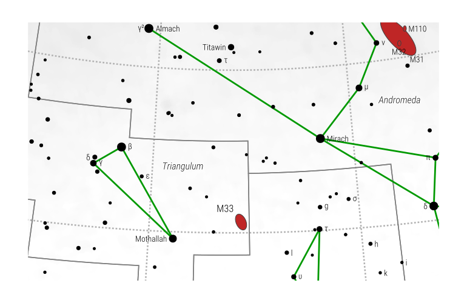
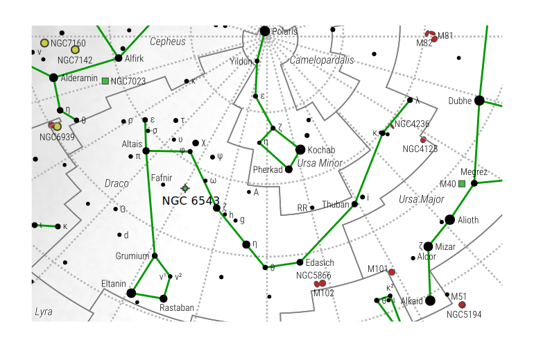

{ .img-fluid .mb-5 }

Club members are urged to post their visual observing experiences (via text,
images, video, audio, sketches…). For astro-photographers and electronic
imagers, please post images and tell us details about your imaging experience.
Post your experiences to the
[Observing Group](https://westminsterastro.groups.io/g/Observing/topics) list
on groups.io.

There is a topic for each of the five objects: Select the topic you want and
click ‘Reply' to the first message in the topic. And post away! You can also
read and reply to the posts of other astronomers right on the website. There is
also a topic for posting observations of other objects in August – let us know
what you are observing!
Caph
### August's Observing Challenge

Are found in northern, eastern, and southern parts of the sky. Here are the details...

#### ⭐ The ‘One Star Challenge' is Caph

Caph (β Cas, SAO 21133, m2.3) is the highest and southernmost of the ‘W' shaped
constellation Cassiopea (i.e. Caph is up and to the right when Cas is rising).
The challenge is not only to find Caph, but to be able to locate it at different
times of the night and at the beginning and the end of the month (and into late
summer and fall). Make sure you also find and identify the other three stars in
Cassiopea---Schedar, Ruchbah, and Segin. Cassiopea is visible all night in
August.

Caph is a yellow-white giant star 27X more luminous than the sun and located 55
light years from earth. Caph is a Delta Scuti variable star, which is an
important type of ‘standard candle' used to interstellar establish distances.

{ .img-fluid .mb-5 }

#### ⭐⭐ The ‘Two Star Challenge' is Almach[^1]

Almach (several variant spellings, also Gamma Andromedae) is the 3rd brightest
star in the constellation Andromeda. Almach is visible to the naked eye
(magnitude 2.3) as a single point but actually is a double/multiple star system.
Almach is the northernmost star in the constellation Andromeda (i.e. furthest
left as Andromeda rises).

Check out some of the other stars in Andromeda---moving south ward (i.e. towards
the right): Mirach (m2.1), Delta Andromedae (m 3.4), and Alpheratz (m2.0).
Alpheratz is northernmost and brightest star in the ‘square of Pegasus'---see if
you can find the other three in the square (m2.5-2.8). Then point your scope
back to Almach and increase the magnification. In the scope you can see the two
stars: Ύ Andromedae A (m2.3) is yellow/orange, and Ύ Andromedae B (m4.8) is
blueish.

{ .img-fluid .mb-5 }

#### ⭐⭐⭐ The ‘Three Star Challenge' is The Lagoon Nebula

The Lagoon Nebula (M8, NGC 652) is a large emission nebula where interstellar
gases are ionized and glow (magnitude 4) due to radiation from hot young nearby
stars. It is found in the easternmost part of the constellation Sagittarius
(i.e. to the right as one looks south). You will need an open southern view
because the nebula reaches a peak elevation of only 25 degrees (just W of due
South).

The nebula spans 110 by 50 light-years, which is seen by us as an angular
measurement of 90' by 40' ; the nebula is located about
4,000--6,000 light-years from Earth, The nebula contains the young open
cluster NGC 6530 within its structure.

{ .img-fluid .mb-5 }

#### ⭐⭐⭐⭐ The ‘Four Star Challenge' is the Triangulum Galaxy

The Triangulum Galaxy (M33, NGC 598, m5.7) gets its name from the small
somewhat nearby constellation of Triangulum. It is a striking spiral galaxy
that is 2.8 million light years from Earth (2nd closest galaxy), and it is the
third largest galaxy in the Local Group (after Andromeda and Milky Way
systems).

At m5.7, the Triangulum galaxy is considered to be the furthest object from
earth that is visible to the naked eye. The Triangulum Galaxy lacks a central
super massive black hole and consequently is disc shaped, lacking the central
bulge seen in many spiral galaxies.

{ .img-fluid .mb-5 }

#### ⭐⭐⭐⭐⭐ The 'Five Star Challenge' is The Cat's Eye Nebula

The Cat's Eye Nebula (Caldwell 6, NGC 6543, m8.6) is a strikingly colorful and
multilayered planetary nebula which is found in the northern constellation of
Draco. NGC 6543 is directly above the Earth's ecliptic axis---an axis
perpendicular to the plane of the Earth's orbit.  Therefore, NGC 6543 will be
found 23.5 degrees from Polaris.

A ‘planetary' nebula is an emission nebula which forms when small to medium
star, in the red giant phase of its evolution pushes its outer layers away while
its interior collapses and heats up. Intense UV radiation from very hot central
part of the star stimulates emission from the expanding outer gas cloud.  The
Sun will have a planetary nebula phase in its evolution. The Cat's Eye Nebula
has a central Wolf-Rayet star (m10.1) and has concentric layers of gas and dust
(like an onion) from multiple episodes of gas ejection and expansion, thought to
have occurred every 1500 years.

{ .img-fluid .mb-5 }

#### 🪐 The Extra Special Late Night/Early Morning Challenge continues...

The challenge is to observe the transit of Titan's shadow across the face of Saturn.  
You have two opportunities in August:

1. early morning on August 3rd, Transit begins at 2:25am EDT and ends at
   7:04amEDT (sunrise 6:09am)
2. early morning on August 19th.  The transit begins at 1:52am EDT, reaches its
   midpoint at 4:01am EDT, ends 6:00amEDT, (sunrise 6:23am)

[^1]: From the Turkish word 'kara-kulac', the Caracal or Perian (Desert) Lynx 'Caracal' description from Wikipedia: "Typically nocturnal, the caracal is highly secretive and difficult to observe. It lives mainly alone or in pairs." (I kid you not...)
