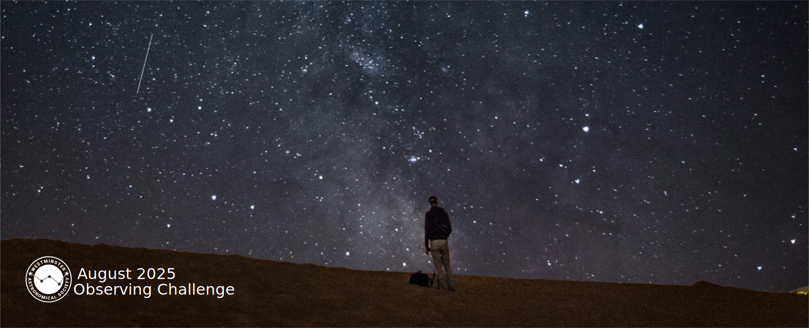
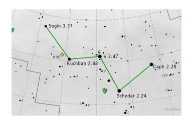
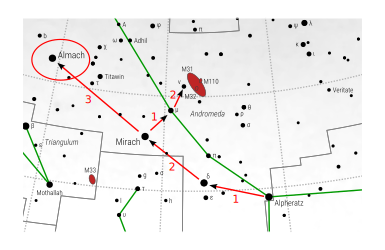

{ .img-fluid .mb-5 }

## August Observing Challenge

Club members are urged to post their visual observing experiences (via text,
images, video, audio, sketches…). For astro-photographers and electronic
imagers, please post images and tell us details about your imaging experience.
Post your experiences by accessing our Observing Group on the web at:
https://westminsterastro.groups.io/g/Observing/topics

There is a topic for each of the five objects: Select the topic you want and
click ‘Reply’ to the first message in the topic. And post away! You can also
read and reply to the posts of other astronomers right on the website. There is
also a topic for posting observations of other objects in August – let us know
what you are observing!

### August’s Observing Challenge Objects:

Are found in northern, eastern, and southern parts of the sky. Here are the details...

#### ⭐ The ‘One Star Challenge’ is Caph, (β Cas, SAO 21133) (m2.3).

{ .img-fluid .float-end}

Caph is the highest and southernmost of the ‘W’ shaped constellation Cassiopea
(i.e. Caph is up and to the right when Cas is rising). The challenge is not only
to find Caph, but to be able to locate it at different times of the night and at
the beginning and the end of the month (and into late summer and fall). Make
sure you also find and identify the other three stars in Cassiopea---Schedar,
Ruchbah, and Segin. Cassiopea is visible all night in August.

Caph is a yellow-white giant star 27X more luminous than the sun and located 55
light years from earth. Caph is a Delta Scuti variable star, which is an
important type of ‘standard candle’ used to interstellar establish distances.

---

#### ⭐⭐ The ‘Two Star Challenge’ is Almach.

{ .img-fluid .float-start}

Almach (several variant spellings,
also Gamma Andromedae) is the 3rd brightest star in the constellation Andromeda.
Almach is visible to the naked eye (magnitude 2.3) as a single point but
actually is a double/multiple star system. Almach is the northernmost star in
the constellation Andromeda (i.e. furthest left as Andromeda rises).

Check out some of the other stars in Andromeda---moving south ward (i.e. towards
the right): Mirach (m2.1), Delta Andromedae (m 3.4), and Alpheratz (m2.0).
Alpheratz is northernmost and brightest star in the ‘square of Pegasus’---see if
you can find the other three in the square (m2.5-2.8). Then point your scope
back to Almach and increase the magnification. In the scope you can see the two
stars: Ύ Andromedae A (m2.3) is yellow/orange, and Ύ Andromedae B (m4.8) is
blueish.

---

#### ⭐⭐⭐ The ‘Three Star Challenge’ is The Lagoon Nebula (M8, NGC 652).

The Lagoon Nebula is a large emission nebula where interstellar gases are
ionized and glow (magnitude 4) due to radiation from hot young nearby stars. It
is found in the easternmost part of the constellation Sagittarius (i.e. to the
right as one looks south). You will need an open southern view because the
nebula reaches a peak elevation of only 25 degrees (just W of due South).

The nebula spans 110 by 50 light-years, which is seen by us as an angular
measurement of 90' by 40' ; the nebula is located about
4,000–6,000 light-years from Earth, The nebula contains the young open
cluster NGC 6530 within its structure.
