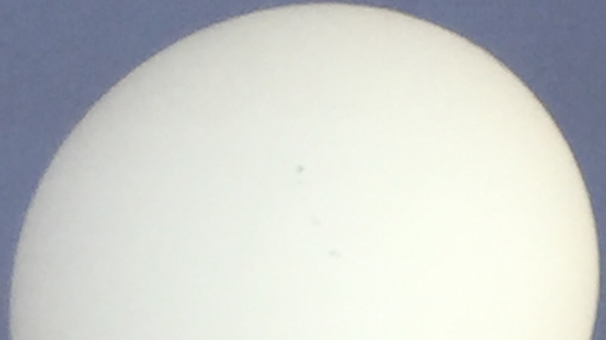

{ .img-fluid .mb-5 }

Astronomers have charted the sun’s cycle of sunspot maximum and minimum for
hundreds of years. The roughly 11-year cycle includes a maximum as the number
of dark visible sunspots crescendos followed by a diminishing number of spots
leading to the cycle minimum. In the most recently completed cycle, the number
of sunspots noticeably diminished. The cycle’s sunspot maximum was the lowest
since the opening decade of the 20th century.

Another of the cycle’s statistics, the average daily sunspot count was the
lowest since this statistic started being tracked in the mid-1800s.

So, what about the next (current) cycle, will it see a return to normal or will
the dearth of sunspots continue?  It depends on who you ask as it comes down to
modeling. One joint model by the National Oceanographic and Atmospheric
Administration and the National Aeronautics and Space Administration NOAA/NASA
predicts yet another weak cycle with little change over the prevailing
circumstances.

But a team from the National Center for Atmospheric Research is predicting that
we can expect the current cycle to deliver the strongest sunspot turnout on
record. The prediction is based on yet another cycle on top of the usual 11
year cycle. Indeed, a couple of large highly complex sunspot groups formed near
the end of the year 2020.

Another solar cycle occurs every 22 years, or every other sunspot cycle, as the
sun experiences a reversal of its magnetic polarity.  It is as if the sun were
a bar magnet whose north and south poles suddenly switch.  The sunspots
themselves have magnetic polarity.  The spots in the sun’s northern hemisphere
have an opposite polarity to the spots in the southern hemisphere.  When the
solar polarity reverses every 22 years so does the magnetic polarity of the
sunspots themselves.  

It should be pointed out that the time periods involved in these cycles has no
bearing on the lifespan of any individual spots themselves.  They form, grow,
shrink and disappear on much shorter cycles of days or weeks.

What does this mean for us on the earth, is there any effect from the growing
and shrinking number of sunspots? Complex active sunspot groups are a source of
magnetic fields and occasionally powerful flares which spew out plasma and
energized particles.  Upon encountering the earth, the solar flare can disrupt
telecommunications and even damage satellites or other space probes. Stronger
flares may induce currents damaging electrical distribution systems on the
ground.  The particles excite the atmosphere causing it to expand. The
expanding atmosphere causes drag on orbiting satellites causing their orbits to
decay faster.

Another question has to do with the effect of sunspots on Earth weather.  The
data is not as clear.  Sunspots appear dark because their temperature is lower
than the solar photosphere – the bright layer of the sun we see.  Although
cooler than the rest of the sun’s surface, some scientists postulate that
sunspots have an overall warming effect on the sun.  And when the sun becomes
warmer then so does Earth.

Amateur astronomers monitor the sun from their back yards using telescopes
specially equipped to safely observe the sun.  Although it remains closed to
the public due to pandemic precautions, the B.F. Roelke Memorial Observatory at
the Bear Branch Nature Center (BBNC) has a telescope specially equipped for
solar viewing. When the observatory reopens so will the opportunity to view the
sun and stars at the facility.

Likewise, the planetarium at BBNC remains closed. Fortunately, the Westminster
Astronomical Society (WASI) hosts a free monthly “virtual planetarium” program
using ZOOM conferencing.  The planetarium programs are presented on the 3rd
Wednesday of the month starting at 7:30 p.m. ET.  The zoom address can be found
on the WASI web site, westminsterastro.org. The ZOOM meeting URL is the same
each month for the recurring programs, so April’s is the same as March’s.
