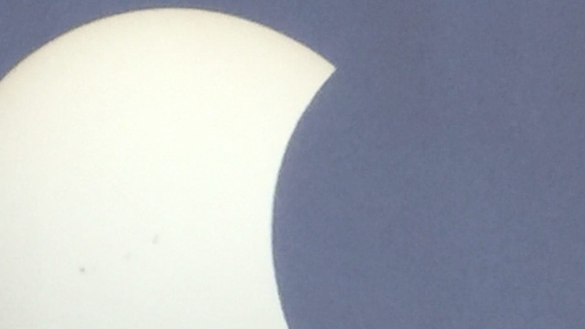

{ .img-fluid .mb-5 }

You might want to start looking for those eclipse glasses you squirreled away
from the great 2017 solar eclipse. On Thursday morning an eclipse of the sun
will already be in progress at sunrise. If you have a good view of the horizon
you should be able to see at least a portion of the partial eclipse. The 2017
eclipse was a total solar eclipse.  However, none of the total phase of that
eclipse was visible anywhere in Maryland.

In Maryland, only a partial eclipse was visible.  It’s the same with Thursday’s
eclipse – in Maryland a partial eclipse will be seen.

As far as total eclipses go, I’ve traveled to the central eclipse path in order
to view five total eclipses in my life time, so far.  The central path is where
the total eclipse occurs. It’s where you must be to view the sun’s pink
prominences and pearly white corona during a solar eclipse.  It’s where the sun
is completely blocked by the moon as viewed from the Earth’s surface.

By the way, the next total eclipse whose central path crosses Maryland won’t
occur until the year 2099.

Thursday’s eclipse is actually part of an annular or ‘ring’ eclipse.  As with
a total eclipse, an annular eclipse’s path across the Earth’s surface also has
a central path. Annular eclipses are less dramatic than a total eclipse and are
basically glorified partial eclipses in that a portion of the sun’s bright
photosphere layer remains visible at all times, so proper and safe optical
filtration is required throughout the eclipse experience. However, within the
path of annularity the sun resembles a golden ring. That is because the dark
unilluminated moon is located directly in front of the sun, but is too far away
to cover the sun’s entire surface.

I’ve been fortunate to have traveled twice to the central paths of annular
eclipses. Plus, I’ve observed countless partial eclipses.

The path of annularity on Thursday starts at sunrise in Ontario, Canada.  The
central path head north and crosses directly over the north pole.  The annular
eclipse ends at sunset in Russia.

Although annularity will not be visible from Maryland, we are being treated to
a rather deep partial solar eclipse.  Other geographical areas will enjoy
various degrees of eclipse magnitude, or none at all.  For example, in my
native Nebraska the eclipse will have ended by sunrise and they see nothing of
the eclipse.

Following are the relevant highlights for Westminster during Thursday’s partial
solar eclipse.

The eclipse is already in progress when the sun rises in Westminster at 5:41
a.m.  In fact, maximum eclipse occurred eight minutes earlier while the sun was
still below the horizon. As the sun rises, the moon is retreating from in front
of the sun, uncovering more and more of the sun.  So, for Westminster, the
maximum visible eclipse occurs at sunrise when about 72% of the sun will be
blocked by the moon. This is why a clear horizon is important.  The partial
eclipse ends at 6:30 a.m. From sunrise until it ends, Westminster residents are
treated to a 49 minute long partial eclipse.

Do you have a location where you can see the rising sun?  If you’re familiar
with the cardinal directions at your site you can estimate where to look.

For this, we use the solar azimuth at sunrise.  On Thursday, June 10 the sun
rises at azimuth +60°.  Azimuth is measured along the horizon. Due north is 0°,
east is +90°, south +180°and west +270°.  Thus, on Thursday the sun rises in
the east-northeast. Is your horizon flat in that direction, without buildings,
trees and clouds?

The sunrise point is moving northward day-by-day until the Summer Solstice.
However, it changes rather slowly and so that you can check actual sunrise
a day or two before the eclipse in order to determine exactly where the sun
will rise on eclipse day and determine if you have a clear unobstructed view.

Remember to use safe methods when viewing the sun.  If using eclipse glasses,
remember not to look through an unfiltered telescope or binoculars with them.
Unfiltered and magnified sunlight will burn a hole through the glasses and
could damage your eyes.
